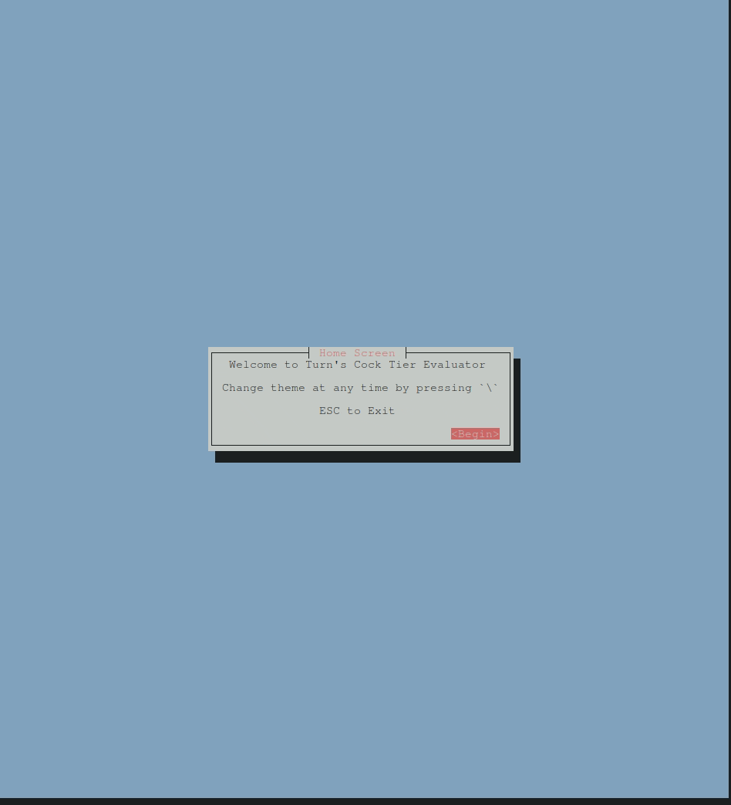

# Turn's Cock Tier Evaluator :chicken: :trophy:

TUI front-end for [cock-lib](https://github.com/im-turn/cock-lib)i

## Demo

## Dependencies

The `cock-tui` relies on and is rendered using [Cursive](https://crates.io/crates/cursive).

[Cursive](https://crates.io/crates/cursive) also requires the `ncurses` lib to be installed on the machine.

## License :clipboard: :briefcase:

MIT License
